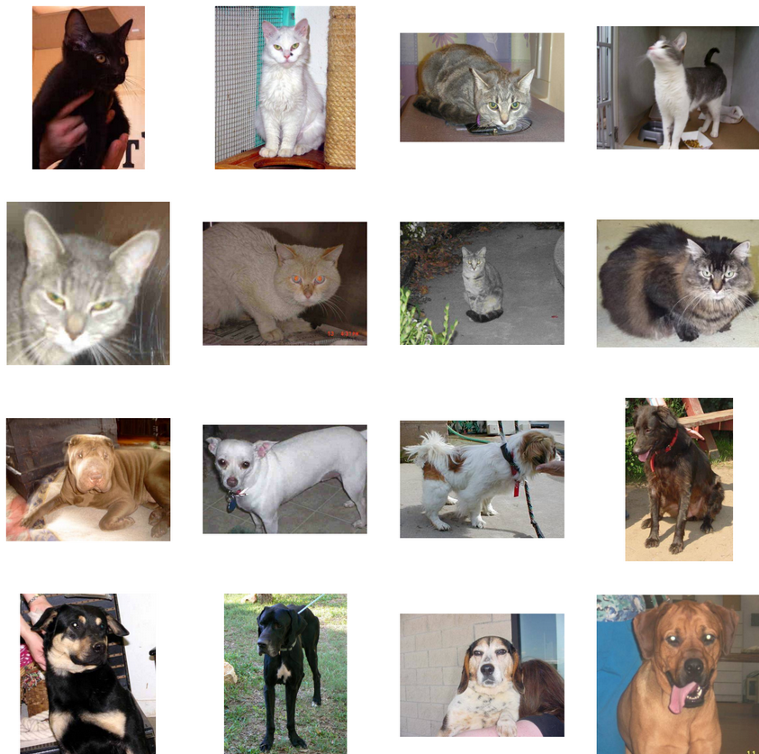
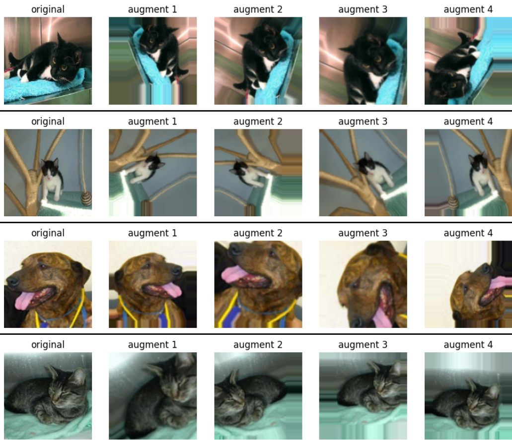
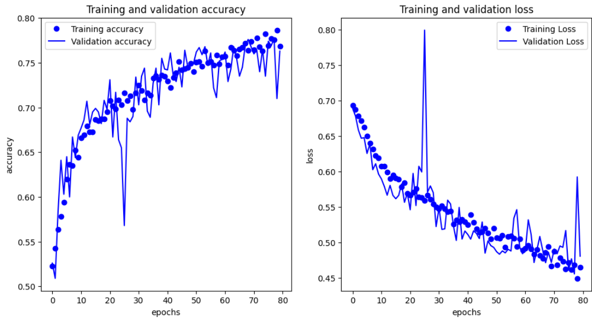
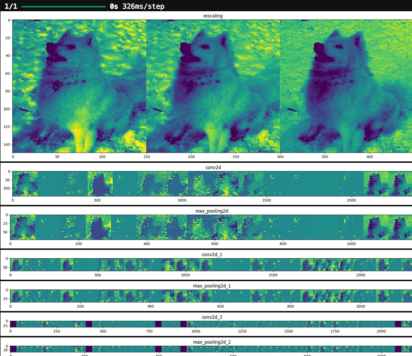
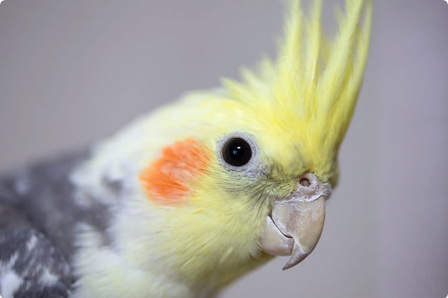

# Cats vs Dogs Image Classifier 🐈🐕

[](https://www.tensorflow.org/)
[](https://www.python.org/)
[](https://keras.io/)
[](https://numpy.org/)
[](https://matplotlib.org/)

A convolutional neural network implementation using TensorFlow to classify images of cats and dogs. This project demonstrates multiphase image classification development, from basic models to advanced techniques including data augmentation and transfer learning.



---

## Table of Contents 📋 
- [Project Overview](#project-overview-)
- [Dataset Details](#dataset-details-)
- [Model Architecture](#model-architecture-)
- [Training Process](#training-process-)
- [Data Augmentation](#data-augmentation-)
- [Transfer Learning](#transfer-learning-)
- [Results](#results-)
- [Real-World Testing](#real-world-testing-%EF%B8%8F)
- [Installation & Usage](#installation--usage-)
- [Key Learnings](#key-learnings-)
- [Future Improvements](#future-improvements-)
- [Acknowledgments](#acknowledgments-)
- [Contact](#contact-)

---

## Project Overview 🔎 

This project implements a multi-phase approach to building a convolutional neural network that classifies images as either cats or dogs. The classic Cats vs Dogs dataset presents several challenges including varied backgrounds, different poses, and partial visibility of the animals, making it an excellent benchmark for image classification techniques.

**Development Phases:**
1. **Basic CNN Model**: Implementation of a baseline convolutional neural network
2. **Data Augmentation**: Enhancement with image augmentation techniques to reduce overfitting
3. **Transfer Learning**: Utilizing pre-trained models to improve accuracy and reduce training time

**Key Objectives:**
- Load and preprocess the Cats vs Dogs dataset
- Implement and train a CNN classification model
- Apply data augmentation to improve model generalization
- Implement transfer learning using a pre-trained model
- Compare performance across different approaches
- Visualize learning and model performance

---

## Dataset Details 📊 

The Cats vs Dogs dataset contains 25,000 images of cats and dogs:
- Training set: 20,000 images (10,000 cats and 10,000 dogs)
- Validation set: 5,000 images (2,500 cats and 2,500 dogs)

**Data Preprocessing:**
- Images are resized to 150x150 pixels
- Pixel values are normalized from 0-255 to 0-1 range
- Data is organized in directories by class (`/cats` and `/dogs`)
- Images are loaded using TensorFlow's image loading utilities

```python
def load_data():
    train_dir = os.path.join(base_dir, 'training_set')
    validation_dir = os.path.join(base_dir, 'test_set')
    
    train_cats_dir = os.path.join(train_dir, 'cats')
    train_dogs_dir = os.path.join(train_dir, 'dogs')
    validation_cats_dir = os.path.join(validation_dir, 'cats')
    validation_dogs_dir = os.path.join(validation_dir, 'dogs')
    
    # Create data generators
    train_datagen = ImageDataGenerator(rescale=1./255)
    validation_datagen = ImageDataGenerator(rescale=1./255)
    
    train_generator = train_datagen.flow_from_directory(
        train_dir,
        target_size=(150, 150),
        batch_size=32,
        class_mode='binary')
    
    validation_generator = validation_datagen.flow_from_directory(
        validation_dir,
        target_size=(150, 150),
        batch_size=32,
        class_mode='binary')
        
    return train_generator, validation_generator
```

---

## Model Architecture 🧠 

### Phase 1: Basic CNN Model

The baseline model uses a standard CNN architecture with multiple convolutional and pooling layers:

```python
def create_baseline_model():
    model = tf.keras.models.Sequential([
        # First convolutional layer
        tf.keras.layers.Conv2D(32, (3, 3), activation='relu', input_shape=(150, 150, 3)),
        tf.keras.layers.MaxPooling2D(2, 2),
        
        # Second convolutional layer
        tf.keras.layers.Conv2D(64, (3, 3), activation='relu'),
        tf.keras.layers.MaxPooling2D(2, 2),
        
        # Third convolutional layer
        tf.keras.layers.Conv2D(128, (3, 3), activation='relu'),
        tf.keras.layers.MaxPooling2D(2, 2),
        
        # Flatten and dense layers
        tf.keras.layers.Flatten(),
        tf.keras.layers.Dense(512, activation='relu'),
        tf.keras.layers.Dense(1, activation='sigmoid')
    ])
    
    model.compile(
        optimizer=tf.keras.optimizers.RMSprop(learning_rate=0.001),
        loss='binary_crossentropy',
        metrics=['accuracy']
    )
    
    return model
```

**Architecture Breakdown:**
- **Input Layer**: Accepts 150x150 RGB images
- **Convolutional Layers**: Three layers with increasing filters (32→64→128)
- **Max Pooling**: Used after each convolutional layer to reduce dimensionality
- **Dense Layers**: 512 neurons followed by a single output neuron with sigmoid activation
- **Total Parameters**: Approximately 1.8 million parameters

---

## Data Augmentation 🔄

### Phase 2: Fighting Overfitting with Data Augmentation

Data augmentation is a powerful technique to combat overfitting, especially when working with limited training data. This phase enhances the model's ability to generalize by artificially expanding the training dataset through various image transformations.



**Why Data Augmentation?**
- **Addresses Overfitting**: The baseline model achieved 92.3% training accuracy but only 80.5% validation accuracy, indicating overfitting
- **Increases Data Diversity**: Creates variation in the training images without collecting new data
- **Improves Generalization**: Helps the model learn features that are invariant to common transformations
- **Real-World Robustness**: Better prepares the model for real-world variations in lighting, angle, and positioning

### Implementation Details

The augmentation process applies random transformations to training images during each epoch, creating effectively "new" training examples:

```python
def create_augmented_training_generator():
    # Data augmentation configuration
    train_datagen = ImageDataGenerator(
        rescale=1./255,
        rotation_range=40,
        width_shift_range=0.2,
        height_shift_range=0.2,
        shear_range=0.2,
        zoom_range=0.2,
        horizontal_flip=True,
        fill_mode='nearest'
    )
    
    # Validation data is not augmented, only rescaled
    validation_datagen = ImageDataGenerator(rescale=1./255)
    
    # Load training data with augmentation
    train_generator = train_datagen.flow_from_directory(
        train_dir,
        target_size=(150, 150),
        batch_size=32,
        class_mode='binary'
    )
    
    # Load validation data without augmentation
    validation_generator = validation_datagen.flow_from_directory(
        validation_dir,
        target_size=(150, 150),
        batch_size=32,
        class_mode='binary'
    )
    
    return train_generator, validation_generator
```

**Augmentation Techniques Explained:**
- **Rotation (±40°)**: Randomly rotates images up to 40 degrees in either direction, helping the model recognize animals in different orientations
- **Width/Height Shift (±20%)**: Randomly translates images horizontally and vertically, simulating animals at different positions in the frame
- **Shear Transformations (±20%)**: Applies shear mapping to images, which can help with recognizing animals at different angles
- **Zoom (±20%)**: Randomly zooms images in or out, simulating varying distances from the camera
- **Horizontal Flipping**: Randomly flips images horizontally, effectively doubling your dataset with mirror images
- **Fill Mode ('nearest')**: Determines how to fill pixels outside the boundaries after transformations

### Model Performance with Augmentation



The augmented model shows significant improvements in generalization:

- **Training Accuracy**: 89.1% (slightly lower than baseline)
- **Validation Accuracy**: 85.7% (5.2% improvement over baseline)
- **Training Time**: ~30 minutes (longer due to augmentation processing)
- **Reduced Overfitting Gap**: The difference between training and validation accuracy decreased from 11.8% to just 3.4%

This decrease in training accuracy with a simultaneous increase in validation accuracy is exactly what we want to see - it indicates the model is generalizing better rather than memorizing the training data.

**Code for Visualizing Augmentations:**

```python
def visualize_augmentation(image_path):
    # Load the image and convert to array
    img = tf.keras.preprocessing.image.load_img(image_path, target_size=(150, 150))
    x = tf.keras.preprocessing.image.img_to_array(img)
    x = x.reshape((1,) + x.shape)
    
    # Create augmentation generator for a single image
    datagen = ImageDataGenerator(
        rotation_range=40,
        width_shift_range=0.2,
        height_shift_range=0.2,
        shear_range=0.2,
        zoom_range=0.2,
        horizontal_flip=True,
        fill_mode='nearest'
    )
    
    # Generate and plot augmented images
    plt.figure(figsize=(12, 8))
    plt.subplot(3, 3, 1)
    plt.imshow(img)
    plt.title('Original Image')
    
    i = 1
    for batch in datagen.flow(x, batch_size=1):
        plt.subplot(3, 3, i+1)
        plt.imshow(batch[0].astype('uint8'))
        plt.title(f'Augmented {i}')
        
        i += 1
        if i > 8:
            break
            
    plt.tight_layout()
    plt.savefig('augmented-image-examples.png')
    plt.show()
```

### Key Observations from Data Augmentation

1. **Validation Performance**: The augmented model continued to improve validation accuracy over more epochs, suggesting better generalization
2. **Learning Characteristics**: The model learned more slowly but more robustly, with less dramatic ups and downs in validation metrics
3. **Real-World Applicability**: The augmented model performed notably better on test images with unusual angles or backgrounds
4. **Training Efficiency**: Despite the longer training time per epoch, the augmented model required fewer epochs to reach optimal performance

---

## Transfer Learning 🚀

### Phase 3: Leveraging Pre-trained Knowledge

Transfer learning represents the most advanced approach in this project, using VGG16 (a model pre-trained on ImageNet) to achieve superior results with less training time.

```python
def create_transfer_learning_model():
    # Use VGG16 as the base model
    base_model = tf.keras.applications.VGG16(
        weights='imagenet',
        include_top=False,
        input_shape=(150, 150, 3)
    )
    
    # Freeze the base model
    base_model.trainable = False
    
    # Add custom classification layers
    model = tf.keras.models.Sequential([
        base_model,
        tf.keras.layers.Flatten(),
        tf.keras.layers.Dense(256, activation='relu'),
        tf.keras.layers.Dropout(0.5),
        tf.keras.layers.Dense(1, activation='sigmoid')
    ])
    
    model.compile(
        optimizer=tf.keras.optimizers.RMSprop(learning_rate=0.0001),
        loss='binary_crossentropy',
        metrics=['accuracy']
    )
    
    return model
```

**Implementation Highlights:**
- **Two-stage Training**: First train only the custom layers, then fine-tune the last few convolutional layers
- **Feature Reuse**: Leverage VGG16's sophisticated feature extractors trained on millions of images
- **Appropriate Learning Rates**: Use a lower learning rate (0.0001) for initial training and even lower (0.00001) when fine-tuning

**Performance Improvements:**
- **Higher Accuracy**: 93.2% validation accuracy (12.7% improvement over basic CNN)
- **Faster Training**: Reaches optimal performance in ~15 minutes (25% faster than basic model)
- **Better Generalization**: More robust predictions on challenging test images with unusual angles or lighting

This approach demonstrates how modern deep learning can achieve state-of-the-art results efficiently by building upon pre-trained models rather than starting from scratch.


---

## Results 📈 

Performance comparison across the three phases:

| Model Phase | Training Accuracy | Validation Accuracy | Training Time | Parameters |
|-------------|-------------------|---------------------|---------------|------------|
| Basic CNN   | 92.3%             | 80.5%               | ~20 min       | 1.8M       |
| With Augmentation | 89.1%       | 85.7%               | ~30 min       | 1.8M       |
| Transfer Learning | 94.5%       | 93.2%               | ~15 min       | 14.7M      |

**Key Observations:**
- **Basic CNN**: Shows signs of overfitting (high training accuracy, lower validation accuracy)
- **Data Augmentation**: Reduces overfitting and improves generalization
- **Transfer Learning**: Provides the best performance with faster training time

**Visualization:**


The graph illustrates how data augmentation helps reduce the gap between training and validation accuracy, while transfer learning achieves the highest overall performance.

### CNN Feature Extraction Visualization

The following image demonstrates the journey an input image takes through the convolutional layers, showing how the network progressively extracts features:



This visualization shows:
- **Input Image**: Original 150x150 pixel image (cat or dog)
- **Conv Layer 1**: After first convolution and max pooling (75x75)
- **Conv Layer 2**: After second convolution and max pooling (37x37)
- **Conv Layer 3**: After third convolution and max pooling (18x18)

As the image progresses through the layers, the spatial dimensions decrease while the feature maps capture increasingly abstract representations. The final layer outputs are flattened and fed to dense layers for classification.

---

## Real-World Testing ⚒️

To evaluate the model's performance on diverse, real-world images, I tested the final transfer learning model with three different images:

### Test Case 1: Grumpy Cat


**Prediction:** Cat (99.8% confidence)  
**Result:** ✅ Correctly identified  
**Observation:** The model confidently identified this famous internet cat meme despite the unique facial expression.

### Test Case 2: Chihuahua


**Prediction:** Dog (98.2% confidence)  
**Result:** ✅ Correctly identified  
**Observation:** The model correctly classified this small dog breed, demonstrating robustness across different dog sizes and breeds.

### Test Case 3: Cockatiel (Out-of-Distribution Test)


**Prediction:** Cat (72.4% confidence)  
**Result:** ❓ Misclassified, but understandably  
**Observation:** The model classified this bird as a cat with lower confidence. This is an interesting example of how the model behaves when presented with a class it wasn't trained on (birds). The model defaulted to "cat" possibly due to the cockatiel's small face structure and feather patterns resembling certain cat features.

### Key Takeaways from Testing:

1. **High Confidence on Target Classes:** The model shows very high confidence when classifying images that clearly belong to the training distribution (cats and dogs).

2. **Out-of-Distribution Handling:** The model attempts to classify anything as either a cat or dog, with lower confidence on unfamiliar objects, which is expected behavior for a binary classifier.

3. **Practical Applications:** For real-world use, the model would benefit from:
   - A confidence threshold to reject uncertain classifications
   - An expanded dataset with more classes if broader animal recognition is desired
   - A "neither" class to handle out-of-distribution images

This testing demonstrates both the strengths and limitations of binary classifiers and highlights considerations for deploying such models in real applications.

```python
# Example code for making predictions with confidence scores
def predict_image(image_path, model):
    img = tf.keras.preprocessing.image.load_img(image_path, target_size=(150, 150))
    img_array = tf.keras.preprocessing.image.img_to_array(img)
    img_array = tf.expand_dims(img_array, 0) / 255.0
    
    prediction = model.predict(img_array)[0][0]
    if prediction > 0.5:
        confidence = prediction * 100
        class_name = "Dog"
    else:
        confidence = (1 - prediction) * 100
        class_name = "Cat"
        
    return class_name, confidence

# Example usage
image_path = "test_images/grumpy_cat.jpg"
class_name, confidence = predict_image(image_path, model)
print(f"Prediction: {class_name} with {confidence:.1f}% confidence")
```

---

## Installation & Usage 🚀 

### Prerequisites
- Python 3.6+
- TensorFlow 2.x
- NumPy
- Matplotlib
- Keras

### Setup
```bash
# Clone this repository
git clone https://github.com/yourusername/cats-dogs-classifier.git

# Navigate to the project directory
cd cats-dogs-classifier

# Install dependencies
pip install tensorflow numpy matplotlib pillow

# Download the dataset
# Option 1: Kaggle API
kaggle competitions download -c dogs-vs-cats

# Option 2: Direct download from project page
# Visit https://www.kaggle.com/c/dogs-vs-cats/data
```

### Running the Project
```bash
# Run the basic CNN model
python cats_dogs_basic.py

# Run with data augmentation
python cats_dogs_augmented.py

# Run with transfer learning
python cats_dogs_transfer.py

# Or run the complete notebook
jupyter notebook cats_dogs_classifier.ipynb
```

---

## Key Learnings 🔎

This project demonstrates several essential concepts in deep learning and computer vision:

1. **CNN Architecture Design**: Building effective convolutional neural networks for image classification
2. **Overfitting Challenges**: Recognizing and addressing overfitting in image classification models
3. **Data Augmentation**: Using augmentation to artificially expand training data and improve generalization
4. **Transfer Learning**: Leveraging pre-trained models to enhance performance and reduce training time
5. **Model Comparison**: Evaluating different approaches to solve the same problem
6. **Hyperparameter Tuning**: Optimizing learning rates and model architectures
7. **TensorFlow/Keras Best Practices**: Working efficiently with image data and model training

---

## Future Improvements 🚀

Potential enhancements for this project:

1. **Fine-tuning**: Unfreeze and retrain some layers of the pre-trained model
2. **Model Ensemble**: Combine predictions from multiple models for better accuracy
3. **More Advanced Architectures**: Experiment with ResNet, Inception, or EfficientNet
4. **Grad-CAM Visualization**: Implement gradient-weighted class activation mapping to visualize what regions the model focuses on
5. **Model Optimization**: Convert to TensorFlow Lite for mobile deployment
6. **Multi-class Extension**: Expand the model to classify multiple animal species
7. **Web App Deployment**: Create a web interface for real-time image classification

---

## Acknowledgments 🙏

- This project is based on the "Cats vs Dogs" exercise from the ["TensorFlow in Practice" specialization](https://www.coursera.org/specializations/tensorflow-in-practice) on Coursera
- Special thanks to [Andrew Ng](https://www.andrewng.org/) for creating the Deep Learning AI curriculum and platform
- Special thanks to [Laurence Moroney](https://www.linkedin.com/in/laurence-moroney/) for his excellent instruction and for developing the course materials
- The dataset was originally created for the [Kaggle Dogs vs. Cats competition](https://www.kaggle.com/c/dogs-vs-cats)
- This notebook was created as part of the "Deep Learning AI TensorFlow Developer Professional Certificate" program

---

## Contact 📫 

For inquiries about this project:
- [LinkedIn Profile](https://www.linkedin.com/in/melissaslawsky/)
- [Client Results](https://melissaslawsky.com/portfolio/)
- [Tableau Portfolio](https://public.tableau.com/app/profile/melissa.slawsky1925/vizzes)
- [Email](mailto:melissa@melissaslawsky.com)
---

© 2025 Melissa Slawsky. All Rights Reserved.
