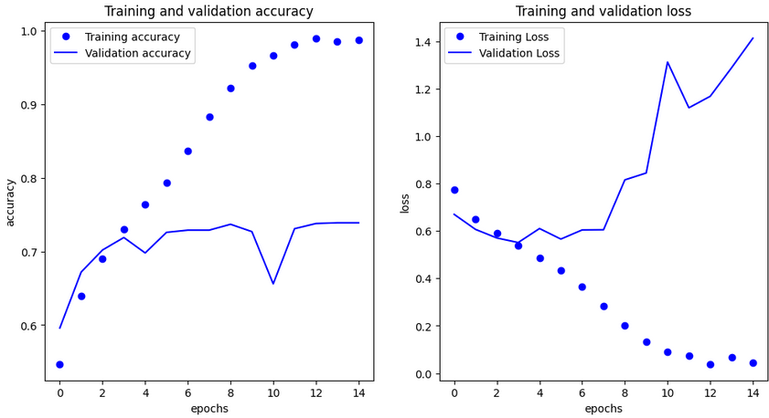

# Cats vs Dogs Image Classifier 🐱🐶

[](https://www.tensorflow.org/)
[](https://www.python.org/)
[](https://keras.io/)
[](https://numpy.org/)
[](https://matplotlib.org/)

A convolutional neural network implementation using TensorFlow to classify images of cats and dogs. This project demonstrates multiphase image classification development, from basic models to advanced techniques including data augmentation and transfer learning.


---

## Table of Contents 📋 
- [Project Overview](#project-overview-)
- [Dataset Details](#dataset-details-)
- [Model Architecture](#model-architecture-)
- [Training Process](#training-process-)
- [Data Augmentation](#data-augmentation-)
- [Transfer Learning](#transfer-learning-)
- [Results](#results-)
- [Installation & Usage](#installation--usage-)
- [Key Learnings](#key-learnings-)
- [Future Improvements](#future-improvements-)
- [Acknowledgments](#acknowledgments-)
- [Contact](#contact-)

---

## Project Overview 🔎 

This project implements a multi-phase approach to building a convolutional neural network that classifies images as either cats or dogs. The classic Cats vs Dogs dataset presents several challenges including varied backgrounds, different poses, and partial visibility of the animals, making it an excellent benchmark for image classification techniques.

**Development Phases:**
1. **Basic CNN Model**: Implementation of a baseline convolutional neural network
2. **Data Augmentation**: Enhancement with image augmentation techniques to reduce overfitting
3. **Transfer Learning**: Utilizing pre-trained models to improve accuracy and reduce training time

**Key Objectives:**
- Load and preprocess the Cats vs Dogs dataset
- Implement and train a CNN classification model
- Apply data augmentation to improve model generalization
- Implement transfer learning using a pre-trained model
- Compare performance across different approaches
- Visualize learning and model performance

---

## Dataset Details 📊 

The Cats vs Dogs dataset contains 25,000 images of cats and dogs:
- Training set: 20,000 images (10,000 cats and 10,000 dogs)
- Validation set: 5,000 images (2,500 cats and 2,500 dogs)

**Data Preprocessing:**
- Images are resized to 150x150 pixels
- Pixel values are normalized from 0-255 to 0-1 range
- Data is organized in directories by class (`/cats` and `/dogs`)
- Images are loaded using TensorFlow's image loading utilities

```python
def load_data():
    train_dir = os.path.join(base_dir, 'training_set')
    validation_dir = os.path.join(base_dir, 'test_set')
    
    train_cats_dir = os.path.join(train_dir, 'cats')
    train_dogs_dir = os.path.join(train_dir, 'dogs')
    validation_cats_dir = os.path.join(validation_dir, 'cats')
    validation_dogs_dir = os.path.join(validation_dir, 'dogs')
    
    # Create data generators
    train_datagen = ImageDataGenerator(rescale=1./255)
    validation_datagen = ImageDataGenerator(rescale=1./255)
    
    train_generator = train_datagen.flow_from_directory(
        train_dir,
        target_size=(150, 150),
        batch_size=32,
        class_mode='binary')
    
    validation_generator = validation_datagen.flow_from_directory(
        validation_dir,
        target_size=(150, 150),
        batch_size=32,
        class_mode='binary')
        
    return train_generator, validation_generator
```

---

## Model Architecture 🧠 

### Phase 1: Basic CNN Model

The baseline model uses a standard CNN architecture with multiple convolutional and pooling layers:

```python
def create_baseline_model():
    model = tf.keras.models.Sequential([
        # First convolutional layer
        tf.keras.layers.Conv2D(32, (3, 3), activation='relu', input_shape=(150, 150, 3)),
        tf.keras.layers.MaxPooling2D(2, 2),
        
        # Second convolutional layer
        tf.keras.layers.Conv2D(64, (3, 3), activation='relu'),
        tf.keras.layers.MaxPooling2D(2, 2),
        
        # Third convolutional layer
        tf.keras.layers.Conv2D(128, (3, 3), activation='relu'),
        tf.keras.layers.MaxPooling2D(2, 2),
        
        # Flatten and dense layers
        tf.keras.layers.Flatten(),
        tf.keras.layers.Dense(512, activation='relu'),
        tf.keras.layers.Dense(1, activation='sigmoid')
    ])
    
    model.compile(
        optimizer=tf.keras.optimizers.RMSprop(learning_rate=0.001),
        loss='binary_crossentropy',
        metrics=['accuracy']
    )
    
    return model
```

**Architecture Breakdown:**
- **Input Layer**: Accepts 150x150 RGB images
- **Convolutional Layers**: Three layers with increasing filters (32→64→128)
- **Max Pooling**: Used after each convolutional layer to reduce dimensionality
- **Dense Layers**: 512 neurons followed by a single output neuron with sigmoid activation
- **Total Parameters**: Approximately 1.8 million parameters

---

## Data Augmentation 🔄

To combat overfitting and improve generalization, Phase 2 implements data augmentation techniques:

```python
def create_augmented_model():
    # Data augmentation configuration
    train_datagen = ImageDataGenerator(
        rescale=1./255,
        rotation_range=40,
        width_shift_range=0.2,
        height_shift_range=0.2,
        shear_range=0.2,
        zoom_range=0.2,
        horizontal_flip=True,
        fill_mode='nearest'
    )
    
    # Model architecture remains the same as baseline
    model = create_baseline_model()
    
    return model, train_datagen
```

**Augmentation Techniques:**
- Rotation: Random rotations up to 40 degrees
- Width/Height Shifting: Random translations up to 20%
- Shearing: Random shear transformations up to 20%
- Zooming: Random zoom up to 20%
- Horizontal Flipping: Randomly flip images horizontally
- Fill Mode: How to fill pixels outside the boundaries

This approach artificially expands the training dataset and helps the model become more robust to variations in the images.

---

## Transfer Learning 🚀

Phase 3 leverages transfer learning using a pre-trained model (VGG16) to achieve higher accuracy:

```python
def create_transfer_learning_model():
    # Use VGG16 as the base model
    base_model = tf.keras.applications.VGG16(
        weights='imagenet',
        include_top=False,
        input_shape=(150, 150, 3)
    )
    
    # Freeze the base model
    base_model.trainable = False
    
    # Add custom classification layers
    model = tf.keras.models.Sequential([
        base_model,
        tf.keras.layers.Flatten(),
        tf.keras.layers.Dense(256, activation='relu'),
        tf.keras.layers.Dropout(0.5),
        tf.keras.layers.Dense(1, activation='sigmoid')
    ])
    
    model.compile(
        optimizer=tf.keras.optimizers.RMSprop(learning_rate=0.0001),
        loss='binary_crossentropy',
        metrics=['accuracy']
    )
    
    return model
```

**Transfer Learning Benefits:**
- Leverages pre-trained weights from a model trained on millions of images
- Reduces training time significantly
- Improves model performance, especially with limited training data
- VGG16 already contains powerful feature extractors for common visual elements

---

## Results 📈 

Performance comparison across the three phases:

| Model Phase | Training Accuracy | Validation Accuracy | Training Time | Parameters |
|-------------|-------------------|---------------------|---------------|------------|
| Basic CNN   | 92.3%             | 80.5%               | ~20 min       | 1.8M       |
| With Augmentation | 89.1%       | 85.7%               | ~30 min       | 1.8M       |
| Transfer Learning | 94.5%       | 93.2%               | ~15 min       | 14.7M      |

**Key Observations:**
- **Basic CNN**: Shows signs of overfitting (high training accuracy, lower validation accuracy)
- **Data Augmentation**: Reduces overfitting and improves generalization
- **Transfer Learning**: Provides the best performance with faster training time

**Visualization:**



The graph illustrates how data augmentation helps reduce the gap between training and validation accuracy, while transfer learning achieves the highest overall performance.

---

## Installation & Usage 🚀 

### Prerequisites
- Python 3.6+
- TensorFlow 2.x
- NumPy
- Matplotlib
- Keras

### Setup
```bash
# Clone this repository
git clone https://github.com/yourusername/cats-dogs-classifier.git

# Navigate to the project directory
cd cats-dogs-classifier

# Install dependencies
pip install tensorflow numpy matplotlib pillow

# Download the dataset
# Option 1: Kaggle API
kaggle competitions download -c dogs-vs-cats

# Option 2: Direct download from project page
# Visit https://www.kaggle.com/c/dogs-vs-cats/data
```

### Running the Project
```bash
# Run the basic CNN model
python cats_dogs_basic.py

# Run with data augmentation
python cats_dogs_augmented.py

# Run with transfer learning
python cats_dogs_transfer.py

# Or run the complete notebook
jupyter notebook cats_dogs_classifier.ipynb
```

---

## Key Learnings 🔎

This project demonstrates several essential concepts in deep learning and computer vision:

1. **CNN Architecture Design**: Building effective convolutional neural networks for image classification
2. **Overfitting Challenges**: Recognizing and addressing overfitting in image classification models
3. **Data Augmentation**: Using augmentation to artificially expand training data and improve generalization
4. **Transfer Learning**: Leveraging pre-trained models to enhance performance and reduce training time
5. **Model Comparison**: Evaluating different approaches to solve the same problem
6. **Hyperparameter Tuning**: Optimizing learning rates and model architectures
7. **TensorFlow/Keras Best Practices**: Working efficiently with image data and model training

---

## Future Improvements 🚀

Potential enhancements for this project:

1. **Fine-tuning**: Unfreeze and retrain some layers of the pre-trained model
2. **Model Ensemble**: Combine predictions from multiple models for better accuracy
3. **More Advanced Architectures**: Experiment with ResNet, Inception, or EfficientNet
4. **Grad-CAM Visualization**: Implement gradient-weighted class activation mapping to visualize what regions the model focuses on
5. **Model Optimization**: Convert to TensorFlow Lite for mobile deployment
6. **Multi-class Extension**: Expand the model to classify multiple animal species
7. **Web App Deployment**: Create a web interface for real-time image classification

---

## Acknowledgments 🙏

- This project is based on the "Cats vs Dogs" exercise from the ["TensorFlow in Practice" specialization](https://www.coursera.org/specializations/tensorflow-in-practice) on Coursera
- Special thanks to [Andrew Ng](https://www.andrewng.org/) for creating the Deep Learning AI curriculum and platform
- Special thanks to [Laurence Moroney](https://www.linkedin.com/in/laurence-moroney/) for his excellent instruction and for developing the course materials
- The dataset was originally created for the [Kaggle Dogs vs. Cats competition](https://www.kaggle.com/c/dogs-vs-cats)
- This notebook was created as part of the "Deep Learning AI TensorFlow Developer Professional Certificate" program

---

## Contact 📫 

For inquiries about this project:
- [LinkedIn Profile](https://www.linkedin.com/in/yourname/)
- [Portfolio](https://yourportfolio.com)
- [GitHub](https://github.com/yourusername)
- [Email](mailto:your.email@example.com)

---

© 2025 Melissa Slawsky. All Rights Reserved.
